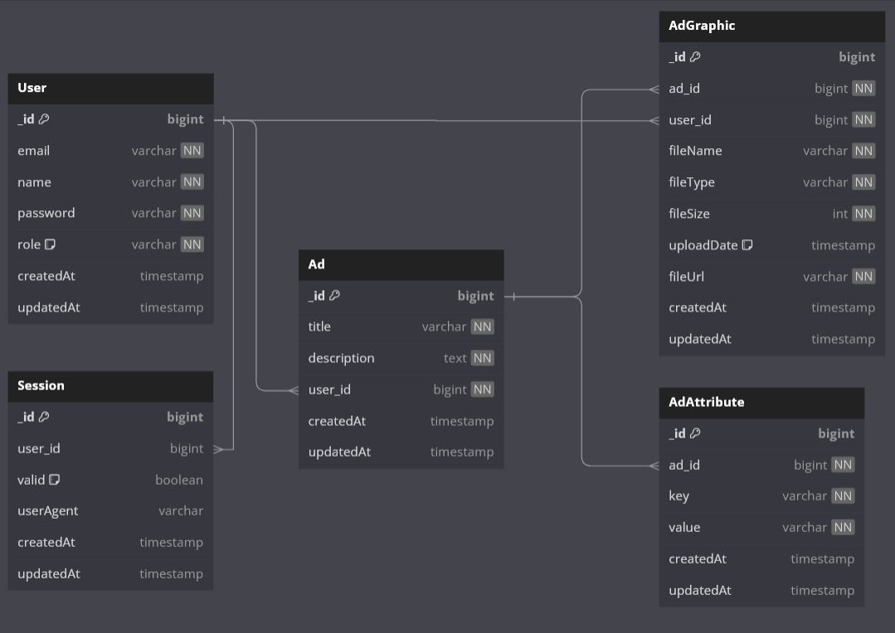
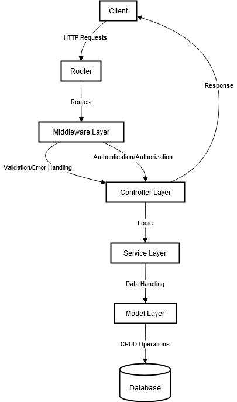

# Advertiser Platform Backend

This project is part of an evaluation for the Backend Engineer position. It involves designing and implementing a backend system using the MERN stack (MongoDB, Express.js, React.js, Node.js) for a platform tailored for advertisers, particularly brands, to compose and manage mailers. The platform offers robust features including authentication, authorization, ad graphics upload service (with video compression), and the ability for advertisers to add attributes such as gender and location to their ads.

## Table of Contents
- [Features](#features)
- [Installation](#installation)
- [Usage](#usage)
- [API Endpoints](#api-endpoints)
- [Technologies and Packages](#technologies-and-packages)
- [Database Design](#database-design)
- [Architecture Overview](#architecture-overview)
- [Acknowledgements](#acknowledgements)

## Features

1. **User Management**
    - **Registration and Login:** Users can register and log in to the platform.
    - **JWT Authentication:** Secure authentication using JSON Web Tokens.
    - **Role-Based Access Control:** Different permissions for Admin, Advertiser, Moderator, Analytics, and Support roles.

2. **Ad Graphics Upload Service**
    - **File Upload:** Supports uploading images and videos for ads.
    - **Video Compression:** Automatic compression of uploaded videos to optimize storage.
    - **Metadata Storage:** Stores metadata such as file name, size, and upload date in MongoDB.

3. **Ad Attributes Management**
    - **Attribute Assignment:** Advertisers can add and manage attributes like target gender, location, and age group for their ads.
    - **Structured Storage:** Attributes are stored in a structured format in MongoDB.

4. **API Endpoints**
    - **RESTful APIs:** Endpoints to support all functionalities with validation and error handling.
    - **Documentation:** API documentation available using tools like Swagger.

## Roles and Permissions

| Resource     | Admin | Advertiser | Moderator | Analytics | Support |
|--------------|-------|------------|-----------|-----------|---------|
| User         | ✔     |            |           |           |         |
| AdGraphics   | ✔     | ✔ (own)    | ✔         | ✔         | ✔       |
| Ad           | ✔     | ✔ (own)    | ✔         | ✔         | ✔       |
| AdAttribute  | ✔     | ✔ (own)    | ✔         | ✔         | ✔       |

## Installation

To set up the project locally, follow these steps:

1. Clone the repository:
    ```bash
    git clone https://github.com/Biruk-Tassew/Backend_Engineer_Task-.git
    cd Backend_Engineer_Task-
    ```

2. Install dependencies:
    ```bash
    # Using yarn
    yarn install

    # OR using npm
    npm install
    ```

3. Set up the environment variables:
    - Create a `.env` file in the root directory.
    - Add the necessary environment variables as shown below:

    ```env
    ACCESS_TOKEN_PUBLIC_KEY=
    ACCESS_TOKEN_PRIVATE_KEY=
    REFRESH_PRIVATE_KEY=
    REFRESH_PUBLIC_KEY=
    CLOUD_NAME=
    CLOUD_API_KEY=
    CLOUD_API_SECRET=
    FOLDER_NAME=
    CLOUDINARY_URL=
    ```

4. Start the development server:
    ```bash
    # Using yarn
    yarn start

    # OR using npm
    npm start
    ```

## Usage

### Running the Project

1. To start the backend server:
    ```bash
    # Using yarn
    yarn start

    # OR using npm
    npm start
    ```

2. The server will be running at `http://localhost:5000`.

### API Documentation

API documentation is provided using Postman. You can refer to the swagger to explore and test the API endpoints.

## API Endpoints

Here are some of the key API endpoints:

### Healthcheck
- **GET /healthcheck** - Check if the app is up and running

### User Authentication and Authorization

- **POST /api/users** - Register a new user
- **POST /api/sessions** - Create a session (login)
- **GET /api/sessions** - Get all sessions for the current user
- **DELETE /api/sessions** - Delete a session (logout)

### Ad Graphics

- **POST /api/ad-graphics** - Upload new ad graphics (images or videos)
- **GET /api/ad-graphics/{id}** - Get ad graphics by ID
- **PUT /api/ad-graphics/{id}** - Update ad graphics by ID
- **DELETE /api/ad-graphics/{id}** - Delete ad graphics by ID

### Ads

- **POST /api/ads** - Create a new ad
- **GET /api/ads/{id}** - Get a specific ad by ID
- **PUT /api/ads/{id}** - Update an existing ad by ID
- **DELETE /api/ads/{id}** - Delete an existing ad by ID
- **GET /api/ads** - Get all ads

### Ad Attributes

- **POST /api/ad-attributes** - Create a new ad attribute
- **PUT /api/ad-attributes/{id}** - Update an ad attribute by ID
- **DELETE /api/ad-attributes/{id}** - Delete an ad attribute by ID
- **GET /api/ad-attributes/ad/{adId}** - Get all attributes for a specific ad
- **GET /api/ad-attributes** - Get all ad attributes

For a detailed list of endpoints and their usage, refer to the swagger documentation.

## Technologies and Packages

### Major Technologies

- **MongoDB:** For database management.
- **Express.js:** For building the backend server and handling requests.
- **React.js:** For building the frontend user interface.
- **Node.js:** For server-side scripting and running the backend.

### Major Packages

- **bcrypt:** For hashing passwords.
- **cloudinary:** For managing and storing media files.
- **cors:** For handling Cross-Origin Resource Sharing.
- **dayjs:** For date manipulation and formatting.
- **dotenv:** For loading environment variables.
- **express:** For building the web server.
- **fluent-ffmpeg:** For video processing and compression.
- **jsonwebtoken:** For generating and verifying JSON Web Tokens.
- **mongoose:** For object data modeling (ODM) with MongoDB.
- **multer:** For handling file uploads.
- **swagger-jsdoc:** For generating Swagger documentation.
- **swagger-ui-express:** For serving the Swagger documentation.
- **zod:** For schema validation and error handling.

## Database Design

Here is the database design diagram for the application:



You can also view and interact with the diagram online at [dbdiagram.io](https://dbdiagram.io/d/66ad166e8b4bb5230e15ff64).

## Architecture Overview

Below is a high-level architectural diagram of our RESTful backend API, showcasing the interaction between different layers of the application.



## Acknowledgements

Thank you for taking the time to explore my project.


